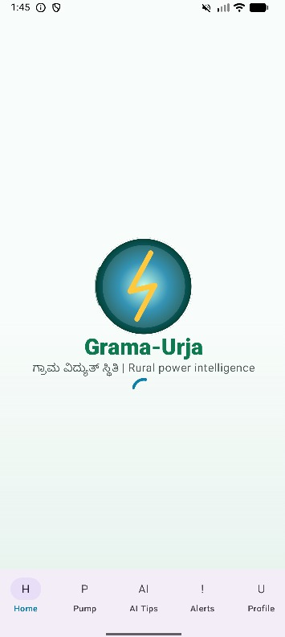
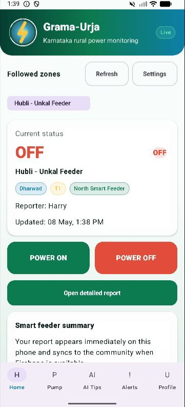
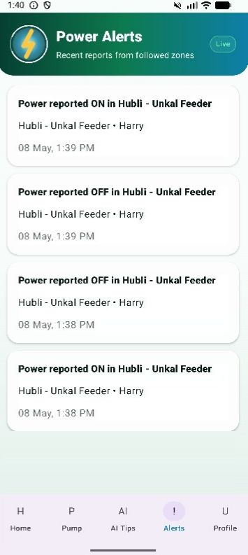
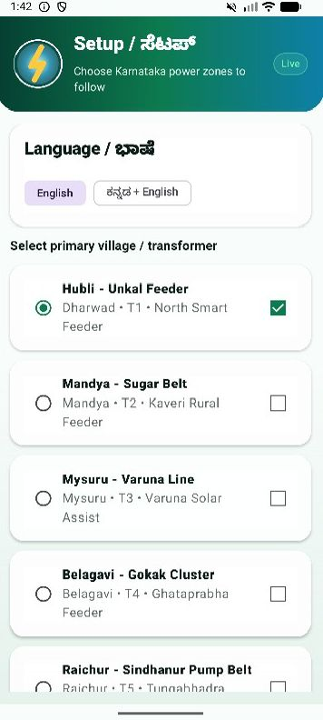
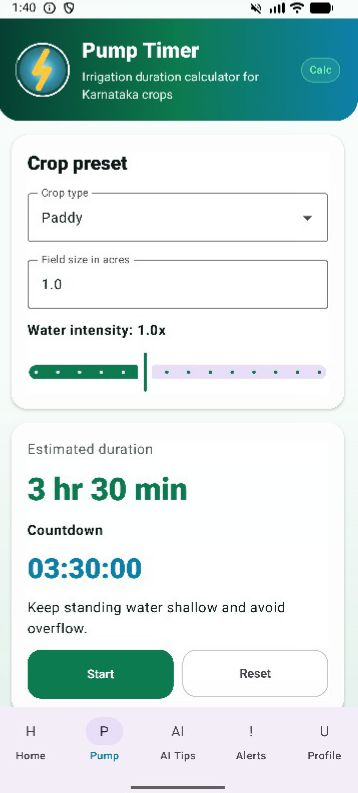
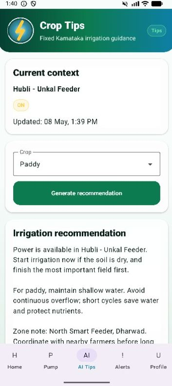
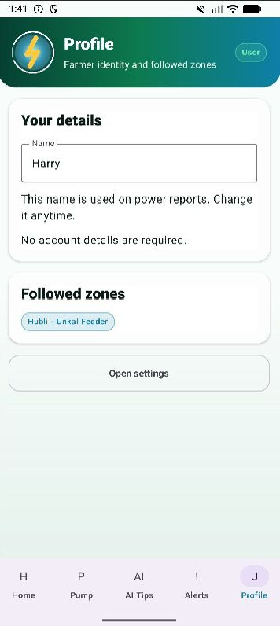

# Grama-Urja

Grama-Urja is an Android app for community-powered rural electricity status monitoring in Karnataka. It helps farmers follow local village or transformer zones, report power ON/OFF status, receive recent power alerts, calculate irrigation pump timing, and get fixed crop-wise watering guidance without requiring a user account.

The app is built as a Kotlin MVP with Jetpack Compose, Material 3, MVVM, Hilt, Firebase Realtime Database, Firebase Cloud Messaging, DataStore preferences, and offline irrigation recommendations.

## App Preview

| Splash | Home | Alerts |
| --- | --- | --- |
|  |  |  |

## Farmer Flow

| Setup | Pump Timer | Crop Tips |
| --- | --- | --- |
|  |  |  |

| Profile |
| --- |
|  |

## Highlights

- No login required for farmer identity and local reports.
- Select and follow Karnataka village or transformer zones.
- Report power ON/OFF status from the current phone.
- Live Firebase Realtime Database status syncing.
- Firebase Cloud Messaging service for zone power updates.
- Recent alerts list for followed zones.
- Pump timer calculator for common Karnataka crops.
- Fixed irrigation guidance for Paddy, Sugarcane, Vegetables, Groundnut, Ragi, Arecanut, Maize, and Cotton.
- Kannada + English UI support.
- DataStore-backed preferences for language, profile name, and followed zones.

## Tech Stack

- Kotlin
- Android Gradle Plugin 9.0.1
- Jetpack Compose with Material 3
- AndroidX Navigation Compose
- Hilt dependency injection
- Firebase Realtime Database
- Firebase Cloud Messaging
- Kotlin coroutines and Flow
- DataStore preferences

## Project Structure

```text
app/src/main/java/com/gramaurja2/app
  GramaUrjaApplication.kt           Hilt application class
  MainActivity.kt                   Compose entry point
  data/
    local/                          DataStore preferences and local power/tips helpers
    remote/firebase/                Firebase status, profile, messaging, and notification repositories
  di/
    AppModule.kt                    Hilt dependency bindings
  domain/model/                     Zone, profile, status, crop, language, and notification models
  navigation/
    GramaUrjaNavGraph.kt            Compose navigation graph
    Route.kt                        Screen route definitions
  presentation/viewmodel/           Screen state and app actions
  ui/
    components/                     Shared Grama-Urja UI components and localization helpers
    screens/                        Splash, onboarding, dashboard, alerts, timer, tips, settings, profile
    theme/                          Compose theme, color, and typography setup
```

## Core Screens

1. Splash
2. Setup / zone selection
3. Home dashboard
4. Power report
5. Power alerts
6. Pump timer
7. Crop tips
8. Profile

## Firebase

Create your own Firebase Android app and place the downloaded file at `app/google-services.json`. The file is ignored by Git so private project configuration is not published.

Enable Realtime Database and Cloud Messaging in Firebase Console.

Realtime Database structure:

```text
zones/{zoneId}/currentStatus
users/{userId}
notifications/{zoneId}/{notificationId}
deviceTokens/{tokenHash}
```

## Getting Started

### Prerequisites

- Android Studio
- JDK 17
- Android SDK with compile SDK 36
- An emulator or Android device running Android 8.0 or newer
- Firebase project configured with Realtime Database and Cloud Messaging

### Run The App

1. Open this folder in Android Studio.
2. Let Gradle sync finish.
3. Add your Firebase `google-services.json` file inside `app/`.
4. Select an emulator or physical device.
5. Run the `app` configuration.

### Command Line Build

```powershell
$env:JAVA_HOME='C:\Program Files\Android\Android Studio\jbr'
$env:Path="$env:JAVA_HOME\bin;$env:Path"
.\gradlew.bat :app:assembleDebug
```

## Typical Workflow

1. Choose the preferred language.
2. Select a primary village or transformer zone.
3. Open the home dashboard to view current power status.
4. Report power ON or OFF for the selected zone.
5. Review alerts from followed zones.
6. Use the pump timer to estimate irrigation duration.
7. Open crop tips for fixed local guidance.

## Data And Privacy

- Farmer identity is stored as a simple local display name.
- Followed zones and language preferences are stored locally with DataStore.
- Power reports sync to Firebase for community visibility.
- `local.properties` and `app/google-services.json` are ignored by Git and should not be committed.

## Current Status

Grama-Urja is an MVP focused on rural power status sharing, simple alerts, irrigation timing, and crop guidance for Karnataka farmers. Good next steps would be richer zone search, admin moderation, and production-ready Firebase security rules.
